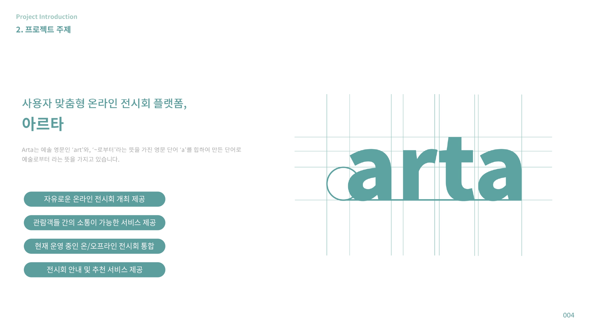
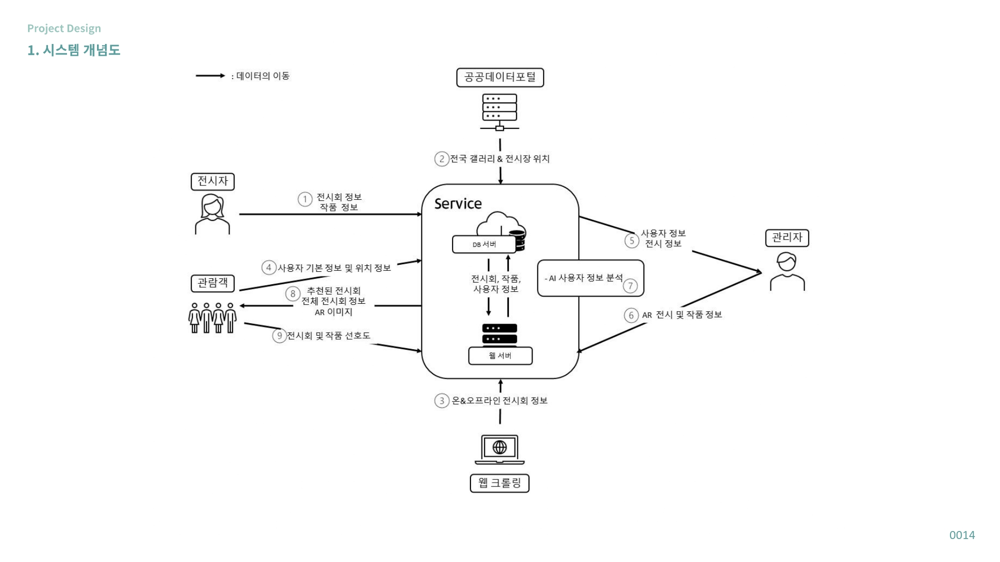

# ARTA : 사용자 맞춤형 온라인 전시회 플랫폼

ARTA는 '예술'의 영문인 'art'와, '~로 부터'라는 뜻을 가진 영문 단어 'a'를 합하여 만든 합성어로 '예술로부터'라는 뜻을 가지고 있습니다.

### 개발 팀 정보

- 팀명 : ARTARY
- 팀장 : 송무송([@moosongsong](https://github.com/moosongsong))
- 팀원 : 조은진([@eunn-jin](https://github.com/eunn-jin)), 문석희([@obok22](https://github.com/obok22)), 주소영

### ARTA.ver1
🔨 Back-end Repository
   

&nbsp; 👈 &nbsp; 

🎨 Front-end Repository

&nbsp; 👈 &nbsp; 

---

### LIVE SERVER

🎆 [Live Server Link](http://fine-village.co.kr/)

시범적으로 운영중인 서버입니다.

---

### 프로젝트 주제

### 프로젝트 주제 선정동기

### 시스템 개념도

